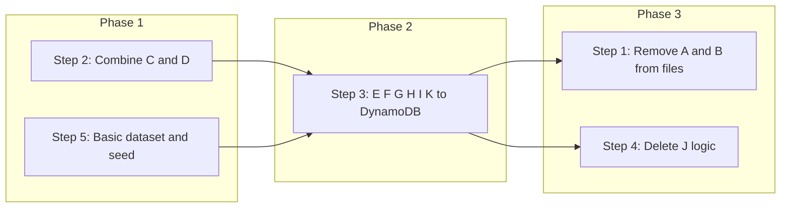

# In-Memory to DynamoDB Migration Plan (Reformed)

This plan is structured around five directives. Implementation order is chosen so that removals do not break callers before DynamoDB and fallback data are in place.

---

## 1. Remove A and B from [heat-sources.ts](src/data/heat-sources.ts) and [heat-consumers.ts](src/data/heat-consumers.ts)

**Goal:** Remove the Ohio seed arrays from these two files so they no longer hold runtime data.

**Actions:**

- In [src/data/heat-sources.ts](src/data/heat-sources.ts):
  - Delete the entire `HEAT_SOURCES_OHIO` array export (the ~17 `HeatSource` objects).
  - Keep or adjust any types/constants that are not the array itself (e.g. `BASE_WASTE_HEAT_MWH`, `HEAT_SOURCE_KEYWORDS` — the latter moves in step 2).
- In [src/data/heat-consumers.ts](src/data/heat-consumers.ts):
  - Delete the entire `HEAT_CONSUMERS_OHIO` array export.
  - Keep or adjust non-array exports; `HEAT_CONSUMER_KEYWORDS` moves in step 2.

**Dependency:** Step 2 (keywords) and step 3 (DynamoDB-only logic) must be done first, or step 1 will break every consumer of `HEAT_SOURCES_OHIO` / `HEAT_CONSUMERS_OHIO`. So **implement step 1 after steps 2 and 3** (or in parallel with step 3 once keywords and DynamoDB paths are in place).

---

## 2. Combine C and D into one file and migrate logic to DynamoDB-related code

**Goal:** Single source of truth for search keywords; usage lives in or alongside DynamoDB modules.

**Actions:**

- **Create one keywords module** (e.g. [src/data/search-keywords.ts](src/data/search-keywords.ts) or [src/api/search-keywords.ts](src/api/search-keywords.ts)):
  - Export `HEAT_SOURCE_KEYWORDS` (industries) and `HEAT_CONSUMER_KEYWORDS` (categories) as const arrays, merged from current definitions in heat-sources.ts and heat-consumers.ts.
- **Remove C and D from** [src/data/heat-sources.ts](src/data/heat-sources.ts) and [src/data/heat-consumers.ts](src/data/heat-consumers.ts).
- **Migrate usage into “DynamoDB” code paths:**
  - **Location Service:** [heat-sources.ts](src/data/heat-sources.ts) and [heat-consumers.ts](src/data/heat-consumers.ts) today call `searchPlacesByKeywords(HEAT_SOURCE_KEYWORDS, ...)` / `HEAT_CONSUMER_KEYWORDS`. Update imports to use the new keywords module.
  - **Tags:** [src/api/handlers/tags.ts](src/api/handlers/tags.ts) currently seeds industries/categories from keywords and (when tables are unset) from Ohio. After migration, tags should use **only DynamoDB** for industries/categories (scan/fetch and derive unique values). Optionally seed the result with the new shared keywords so autocomplete always has a minimum set — in that case, tags handler (or a shared helper used by it) imports from the new keywords file.

**Result:** One file owns keywords; Location Service and tags (if you keep a keyword seed) use that file; no keywords remain in heat-sources.ts / heat-consumers.ts.

---

## 3. Change E, F, G, H, I, and K to use DynamoDB only

**Goal:** No in-memory Ohio data in any of these flows; all read from DynamoDB (and, for location query, optionally from DynamoDB when Location Service is down — see step 5).

**Actions:**

| Item  | Where                                                                                                                                         | Change                                                                                                                                                                                                                                                                                                                                                                         |
| ----- | --------------------------------------------------------------------------------------------------------------------------------------------- | ------------------------------------------------------------------------------------------------------------------------------------------------------------------------------------------------------------------------------------------------------------------------------------------------------------------------------------------------------------------------------ |
| **E** | [heat-sources.ts](src/data/heat-sources.ts)                                                                                                   | Remove `filterOhioSourcesByQuery` and any call sites. List path no longer returns in-memory Ohio.                                                                                                                                                                                                                                                                              |
| **F** | [heat-consumers.ts](src/data/heat-consumers.ts)                                                                                               | Remove `filterOhioConsumersByQuery` and any call sites.                                                                                                                                                                                                                                                                                                                        |
| **G** | [heat-sources.ts](src/data/heat-sources.ts) `getHeatSources()`                                                                                | (1) When `HEAT_SOURCES_TABLE` is unset, return `[]` (or require table and fail fast). (2) When location query is used and Location Service is configured: try AWS Location; on failure or empty, **fall back to DynamoDB** (e.g. `fetchHeatSourcesFromDynamo()` then filter by distance in code) instead of `HEAT_SOURCES_OHIO`. Remove all references to `HEAT_SOURCES_OHIO`. |
| **H** | [heat-consumers.ts](src/data/heat-consumers.ts) `getHeatConsumers()`                                                                          | Same as G for consumers: no table ⇒ empty (or require); location fallback ⇒ DynamoDB, not in-memory.                                                                                                                                                                                                                                                                           |
| **I** | [heat-sources.ts](src/data/heat-sources.ts) `getHeatSourceById()` and [heat-consumers.ts](src/data/heat-consumers.ts) `getHeatConsumerById()` | When table is unset, return `null`. Remove `HEAT_*_OHIO.find(...)` fallback.                                                                                                                                                                                                                                                                                                   |
| **K** | [src/api/handlers/tags.ts](src/api/handlers/tags.ts) `handleGetTags()`                                                                        | Use only DynamoDB to build industries/categories (e.g. `fetchHeatSourcesFromDynamo()` / `fetchHeatConsumersFromDynamo()`, then derive unique industry/category). Remove branches that use `HEAT_SOURCES_OHIO` / `HEAT_CONSUMERS_OHIO`. Optionally merge in the shared keywords from step 2 as a base set.                                                                      |

**Result:** E and F are deleted; G, H, I, and K never read from Ohio arrays and rely on DynamoDB (and, for G/H, on the basic dataset in DynamoDB when Location is down — step 5).

---

## 4. Delete logic related to J in [seedDynamoFromOhio.ts](src/data/seedDynamoFromOhio.ts)

**Goal:** Remove Ohio-based seeding from this script.

**Actions:**

- In [src/data/seedDynamoFromOhio.ts](src/data/seedDynamoFromOhio.ts):
  - Remove imports of `HEAT_SOURCES_OHIO` and `HEAT_CONSUMERS_OHIO`.
  - Remove the logic that loops over those arrays and performs `PutCommand` to DynamoDB (i.e. delete `seedHeatSources()` and `seedHeatConsumers()` bodies that use Ohio data).
- **Disposition of the file:**
  - **Option A:** Delete the file and remove the `seed-dynamo` script from [package.json](package.json) if no other seeding is needed.
  - **Option B:** Keep the file but repurpose it to only seed the **basic fallback dataset** (step 5), so it becomes the script that writes the minimal HeatSource/HeatConsumer set to DynamoDB when Location Services are down.

**Result:** No code in this repo seeds DynamoDB from the old in-memory Ohio arrays.

---

## 5. Basic fallback dataset in DynamoDB for when AWS Location Services are down

**Goal:** When Location Service is unavailable or returns no results, the app falls back to data already stored in DynamoDB (not in-memory).

**Actions:**

- **Define a small baseline dataset:** A minimal set of `HeatSource` and `HeatConsumer` records (e.g. a subset of the current Ohio-like data or a few generic entries). Store this as:
  - **Option A:** Const arrays in a single module used only for seeding (e.g. [src/data/fallback-seed-data.ts](src/data/fallback-seed-data.ts)), or
  - **Option B:** JSON file(s) in repo (e.g. `scripts/fallback-sources.json`, `scripts/fallback-consumers.json`) read by a seed script.
- **Provide a way to load it into DynamoDB:** Either repurpose [seedDynamoFromOhio.ts](src/data/seedDynamoFromOhio.ts) (after step 4) to read this baseline and run `PutCommand` for each item, or add a small script (e.g. `scripts/seed-fallback-data.ts`) that does the same. Ensure table env vars and AWS credentials are required and used.
- **Use it in G and H:** In [heat-sources.ts](src/data/heat-sources.ts) and [heat-consumers.ts](src/data/heat-consumers.ts), the location-query branch already should fall back to DynamoDB when AWS Location fails or returns empty (step 3). Once this baseline is seeded into DynamoDB (e.g. via `npm run seed-dynamo` or the new script), that fallback will return this basic dataset. No extra “in-memory” branch; DynamoDB is the single fallback.

**Result:** When Location Services are down, list APIs still return data by reading from DynamoDB, which has been pre-populated with the basic dataset.

---

## Implementation order (recommended)

1. **Phase 1:** Do step 2 (keywords file + migrate usage) and step 5 (define basic dataset + seed script). No removal of A/B yet.
2. **Phase 2:** Do step 3 (E, F, G, H, I, K use only DynamoDB; location fallback = DynamoDB). Run and seed the basic dataset so fallback works.
3. **Phase 3:** Do step 1 (remove Ohio arrays from heat-sources.ts and heat-consumers.ts) and step 4 (remove Ohio seeding from seedDynamoFromOhio.ts or delete/repurpose file). Fix any remaining references (e.g. tags, seed script) so nothing imports `HEAT_SOURCES_OHIO` or `HEAT_CONSUMERS_OHIO`.

---

## Todo summary

| Todo               | Description                                                                                                                                                |
| ------------------ | ---------------------------------------------------------------------------------------------------------------------------------------------------------- |
| **remove-ab**      | Remove `HEAT_SOURCES_OHIO` and `HEAT_CONSUMERS_OHIO` from [heat-sources.ts](src/data/heat-sources.ts) and [heat-consumers.ts](src/data/heat-consumers.ts). |
| **combine-cd**     | Create single keywords file; move C and D there and update Location Service + tags to use it / DynamoDB.                                                   |
| **dynamo-efghi-k** | E/F: remove filterOhio*. G/H: DynamoDB-only list + location fallback from DynamoDB. I: by-id DynamoDB-only. K: tags from DynamoDB only.                    |
| **delete-j**       | Remove Ohio-seeding logic from [seedDynamoFromOhio.ts](src/data/seedDynamoFromOhio.ts) (and optionally repurpose for basic dataset).                       |
| **basic-dataset**  | Define basic HeatSource/HeatConsumer set; add/repurpose seed script to write it to DynamoDB; use as fallback when Location Services are down.              |

